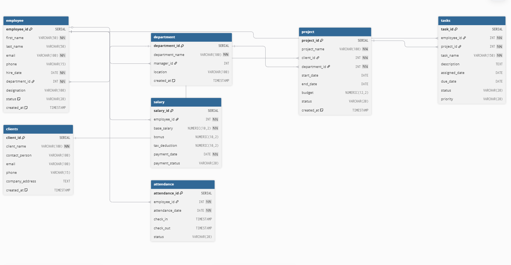

# Assignment 4 - Collaborative Schema Design + ER Diagram

## Problem Statement
As a team, pick any company or domain you find interesting and build its database together. Each intern owns one table.
	Each intern delivers: their table design with correct data types and constraints, justification for every constraint, foreign key linking to at least one teammate's table, realistic dummy data, and an ER diagram with their name as table owner.
	As a group: all tables should connect, run clean on a fresh PostgreSQL database, and end with one meaningful business query joining all tables together.

## Chosen Table: `attendance`

I worked on the **attendance** table for the Employee Management System database.

The purpose of this table is to store employee attendance records such as:
- attendance date
- check-in time
- check-out time
- attendance status

---

# Attendance Table Structure

```sql
CREATE TABLE attendance (
    attendance_id SERIAL PRIMARY KEY,
    employee_id INT NOT NULL,
    attendance_date DATE NOT NULL,
    check_in TIMESTAMP,
    check_out TIMESTAMP,
    status VARCHAR(20)
);
```

---

# Connection with Other Tables

The `attendance` table is connected with the `employee` table using a foreign key.

```sql
employee_id INT REFERENCES employee(employee_id)
```

This relationship helps us identify:
- which employee attended
- attendance history of employees
- employee working hours and status

---

# Constraints Used

| Column | Constraint | Reason |
|---|---|---|
| attendance_id | PRIMARY KEY | Uniquely identifies each attendance record |
| employee_id | NOT NULL | Every attendance record must belong to an employee |
| attendance_date | NOT NULL | Attendance date is mandatory |

---

# Foreign Key Relationship

```sql
Ref "fk_attendance_employee":
"employee"."employee_id" < "attendance"."employee_id"
```

This creates a relationship between:
- `employee` table
- `attendance` table

---

# ER Diagram 

