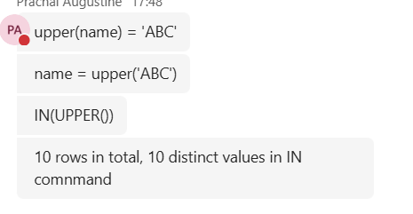

# Assignment 5 - String queries!

 
Which one will run faster and why 

# name = upper('ABC') will be the faster one 

# Because upper(name) = 'ABC' is gonna compare with each row present in the table and update 

Here SQL must: 

SQL Page 1 

# Read each row # Apply UPPER() on every name # Then compare 

Abc => ABC # abc => ABC # xyz => XYZ but not matches ABC in case if where used 

While 

Name = upper('ABC') will just become ABC 

and IN(Upper()) will eventually become name in ('ABC') hence similar to  name = 'ABC' 

check on this one 

TRIM is not gonna work in here because if there would've been spaces 

'     %Delhi%  '  => it would eventually become %Delhi% so TRIM is unnecessary hence It'll accept anything like New Delhi, Greater Delhi area 

Ques => How to get the camel case for it 

SQL Page 2 

SELECT rep_name, INITCAP(rep_name) AS camel_case_name FROM sales; INITCAP provide the feature to make camel_case 

# We can write manual queries => SELECT CONCAT( UPPER(SUBSTRING(rep_name, 1, 1)), LOWER(SUBSTRING(rep_name, 2)) ) AS proper_name FROM sales; 

# but this is just gonna give Amit kumar 

While SELECT CONCAT( UPPER(LEFT(SUBSTRING_INDEX(rep_name, ' ', 1), 1)), LOWER(SUBSTRING(SUBSTRING_INDEX(rep_name, ' ', 1), 2)), ' ', UPPER(LEFT(SUBSTRING_INDEX(rep_name, ' ', -1), 1)), LOWER(SUBSTRING(SUBSTRING_INDEX(rep_name, ' ', -1), 2)) ) AS proper_name FROM sales; # and this might work for names with 2 words but won't work same for 3 or 4 words, hence initcap() is best 

Which lower works faster and why 

Same ques => again same scenerio # In left => it'll lower for each row hence slower # In right => lowers just once and compares hence comparatively faster 

Does it consider two params or more than 2, Replace takes up 3 params => REPLACE(original_string, old_value, new_value) 

SQL Page 3 

For doing this can we use replace function or anything else Replace might fail here => hence we need to write manual query here 

SELECT CONCAT( SUBSTRING_INDEX(name, ' ', 2), '_', SUBSTRING_INDEX(name, ' ', -1) ) FROM sales; 

Here Substring_index(name, ' ', 2) gets us 2 first words separated by space. 

And substring_index(name, ' ', -1) gets us last word separated by space. and we concatenated these both using '_'. 

Gotta read '||' => works as concatenation operator But, anything + NULL = NULL 

# ' Concat ' => MySQL treats null in concat() as Null hence output will be null But postgres works differently hence it'll give 'Electronics' 

# Concat_WS() => with separator Here the syntax is => CONCAT_WS(separator, value1, value2, ...) # it ignores null values 

Read up!! -ve indexes work in sql Alternate way: SELECT SUBSTRING('Amit Kumar' FROM 1 FOR 4); 

SQL Page 4 

